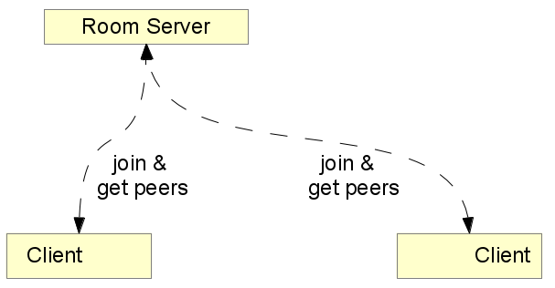
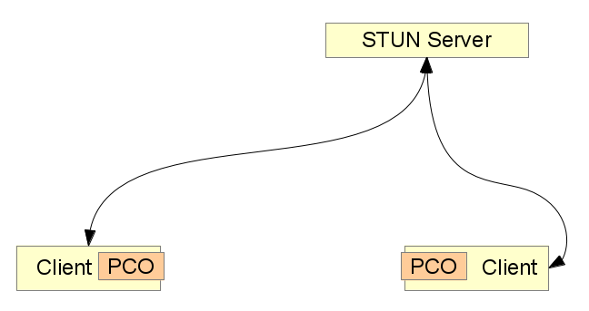
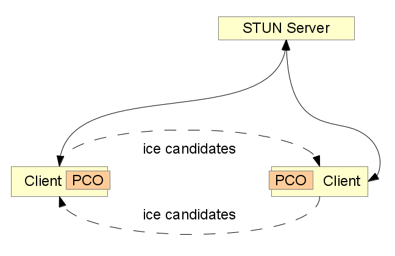
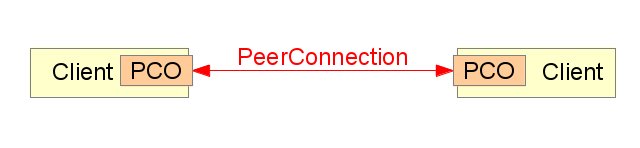
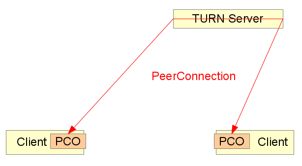

!SLIDE

# Session Establishment

!SLIDE

## Session Establishment
# Signaling Channel

Free to choose: XHR, WS, ...

Developer implements Details

!SLIDE

## Session Establishment
# Signaling Channel

!SLIDE medium-image

## Session Establishment
# Contact Server

!SLIDE

## Session Establishment
# Ensure Agreement

!SLIDE
.notes Renegotiation Possible. Developer not supposed to edit sdp, but can

## Session Establishment
# SDP

Session Description Protocol

Details about Media Capabilities

!SLIDE smaller

## Session Establishment
# SDP Example Token

v=0
o=- 3869962025294249707 2 IN IP4 127.0.0.1
s=-
t=0 0
a=group:BUNDLE audio video
a=msid-semantic: WMS Yhb3bAbcbJfG3I2gQ1CSKyZ1YxLbdP4pPJqd
m=audio 1 RTP/SAVPF 111 103 104 0 8 107 106 105 13 126
c=IN IP4 0.0.0.0
a=rtcp:1 IN IP4 0.0.0.0
a=ice-ufrag:BEu7Lja6FjAY0e9f
a=ice-pwd:j7e1RG5lkZglnryHeqB4drYn
a=ice-options:google-ice
a=fingerprint:sha-256 CE:D3:47:15:E8:5D:64:35:30:32:F7:14:FD:18:17:9C:E1:3A:F2:0B:0B:90:FF:26:90:21:B1:40:68:9C:EA:E7
a=extmap:1 urn:ietf:params:rtp-hdrext:ssrc-audio-level
a=sendrecv
a=mid:audio
a=rtcp-mux
a=crypto:1 AES_CM_128_HMAC_SHA1_80 inline:gFszjZPHhEfqGehRrfnSrGtNqMlzYglKuvewCInq
a=rtpmap:111 opus/48000/2
a=fmtp:111 minptime=10
a=rtpmap:103 ISAC/16000
a=rtpmap:104 ISAC/32000
a=rtpmap:0 PCMU/8000
a=rtpmap:8 PCMA/8000
a=rtpmap:107 CN/48000
a=rtpmap:106 CN/32000
a=rtpmap:105 CN/16000
a=rtpmap:13 CN/8000
a=rtpmap:126 telephone-event/8000
a=maxptime:60
a=ssrc:2710618532 cname:aqZgznSt7eFJwMlw
a=ssrc:2710618532 msid:Yhb3bAbcbJfG3I2gQ1CSKyZ1YxLbdP4pPJqd Yhb3bAbcbJfG3I2gQ1CSKyZ1YxLbdP4pPJqda0
a=ssrc:2710618532 mslabel:Yhb3bAbcbJfG3I2gQ1CSKyZ1YxLbdP4pPJqd
a=ssrc:2710618532 label:Yhb3bAbcbJfG3I2gQ1CSKyZ1YxLbdP4pPJqda0
m=video 1 RTP/SAVPF 100 116 117
c=IN IP4 0.0.0.0
a=rtcp:1 IN IP4 0.0.0.0
a=ice-ufrag:BEu7Lja6FjAY0e9f
a=ice-pwd:j7e1RG5lkZglnryHeqB4drYn
a=ice-options:google-ice
a=fingerprint:sha-256 CE:D3:47:15:E8:5D:64:35:30:32:F7:14:FD:18:17:9C:E1:3A:F2:0B:0B:90:FF:26:90:21:B1:40:68:9C:EA:E7
a=extmap:2 urn:ietf:params:rtp-hdrext:toffset
a=sendrecv
a=mid:video
a=rtcp-mux
a=crypto:1 AES_CM_128_HMAC_SHA1_80 inline:gFszjZPHhEfqGehRrfnSrGtNqMlzYglKuvewCInq
a=rtpmap:100 VP8/90000
a=rtcp-fb:100 ccm fir
a=rtcp-fb:100 nack
a=rtcp-fb:100 goog-remb
a=rtpmap:116 red/90000
a=rtpmap:117 ulpfec/90000
a=ssrc:1347190094 cname:aqZgznSt7eFJwMlw
a=ssrc:1347190094 msid:Yhb3bAbcbJfG3I2gQ1CSKyZ1YxLbdP4pPJqd Yhb3bAbcbJfG3I2gQ1CSKyZ1YxLbdP4pPJqdv0
a=ssrc:1347190094 mslabel:Yhb3bAbcbJfG3I2gQ1CSKyZ1YxLbdP4pPJqd
a=ssrc:1347190094 label:Yhb3bAbcbJfG3I2gQ1CSKyZ1YxLbdP4pPJqdv0

!SLIDE
.notes NAT: The IP4 World is not Ideal...

## Session Establishment
# Hole Punching

!SLIDE

## Hole Punching
# STUN

Session Traversal Utilities for NAT

How are you reachable from the outside world?

!SLIDE

## Hole Punching
# STUN

!SLIDE

## Hole Punching
# ICE

Interactive Connectivy Establishment

Send as many ways to reach each other as possible

!SLIDE

## Hole Punching
# ICE

!SLIDE

## Session Establishment
# Success

!SLIDE

## Hole Punching
# TURN

Traversal Using Relays around NAT

Use a "relay" server for video data, which is not behind NAT

!SLIDE

## Hole Punching
# TURN

!SLIDE
.notes Solutions: Limit ICE candidates: Only TURN IP / Public IP

## Session Establishment
# Privacy Considerations

Participants learns IPs of peers (not only of server)

Private IP (behind NAT) might become known by others

Even if session not established

